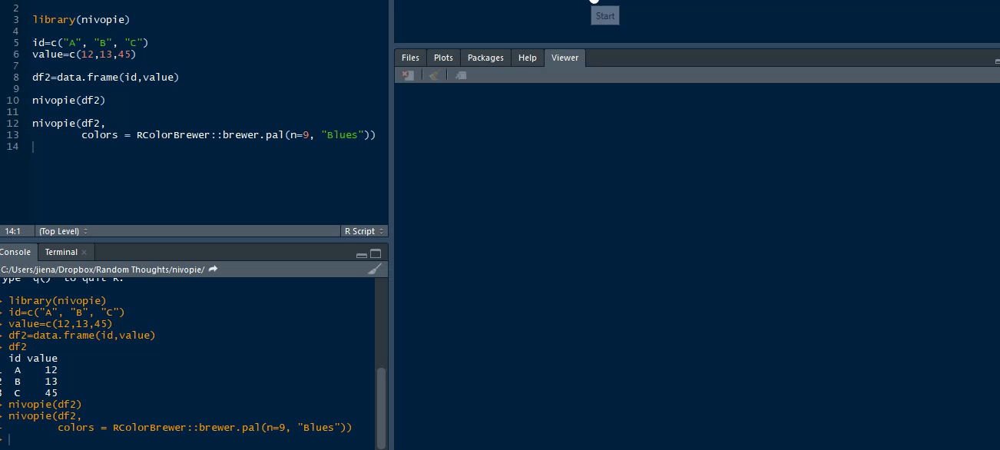

# nivopie
An html widget that creates interactive pie chart

## Install from github
Install from GitHub : 

`devtools::install_github("jienagu/nivopie")`

## Usage:
Step 1: Create a data frame with two column: id and value

```
id=c("A", "B", "C") 
value=c(12,13,45) 
df2=data.frame(id,value)
```

Step 2: use nivopie function

```
library(nivopie) 
nivopie(df2)
```

Optional: a list of common parameters

All parameters are listed in nivo library: https://nivo.rocks/pie

```
# devtools::install_github("jienagu/nivopie")
library(nivopie)

id=c("A", "B", "C", "D", "e", "f", "g")
value=c(12,13,45, 90,250,300,500)
label=c("a", "b", "c", "d", "e", "f", "g")
df2=data.frame(id,value, label)
df2$id=as.factor(df2$id)

nivopie(df2, innerRadius=0.5, cornerRadius=5, fit=T,sortByValue=T,
        colors='nivo', enableRadialLabels=F, radialLabelsLinkDiagonalLength=1,
        radialLabelsLinkHorizontalLength=8,
        enableSlicesLabels=T, sliceLabel='id',isInteractive=T)

```


Then you can see the interactive pie chart in your RStudio View.



Acknowledgement
@timelyportfolio (https://github.com/react-R/nivocal) and reactR (Alan Dipert)
